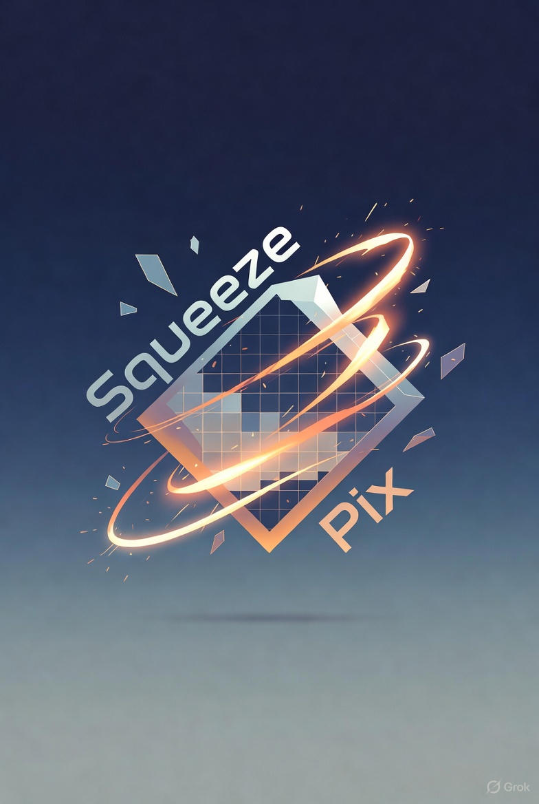
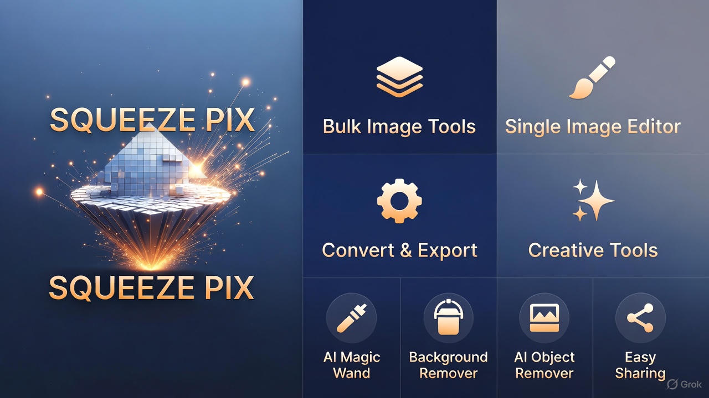
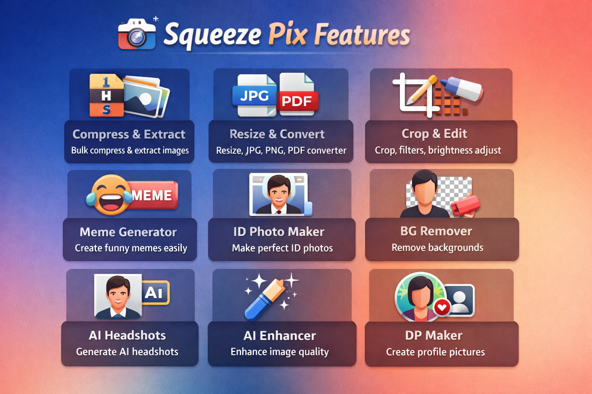

---

<!-- ````md -->
# 📸 Squeeze Pix
### All-in-One Image Compression, Editing & AI Toolkit

<p align="center">
  
</p>

<p align="center">
  Shrink images fast ⚡ • Keep quality high 🎯 • Edit smarter 🧠  
  <br>
  Powerful image tools packed into one lightweight Flutter app
</p>

---

## 🎬 Brand Animation

<!-- <p align="center"> -->
  <!-- <video src="assets/videos/logo_animation.mp4" width="320" autoplay loop muted></video> -->
<!-- </p> -->
<p align="center">
  
</p>
> *Animated brand logo introducing Squeeze Pix*

---

## 🚀 Download App

<p align="center">
  <a href="https://play.google.com/store/apps/details?id=com.hanif.squeezepix">
    
  </a>
</p>

---

## 🖼️ App Banner

<p align="center">
  
</p>

---

## 🎬 App in Action

<!-- <p align="center"> -->
  <!-- <video src="assets/videos/key_features.mp4" width="90%" autoplay loop muted></video> -->
<!-- </p> -->
<p align="center">
  
</p>
<p align="center">
  <b>Bulk Compression • Image Editing • AI Tools • Conversion</b>
</p>

---

## ✨ Key Features

<p align="center">
  

</p>

---

### 📦 Bulk Image Tools
- Compress **multiple images at once**
- Choose **compression percentage (0–100%)** or **exact target size (KB/MB)**
- Extract & **share bulk images instantly**
- Optimized for large batches

---

### 🖼️ Single Image Editor
- Crop, rotate, flip
- Adjust **brightness, contrast & effects**
- Resize with **aspect ratio lock**
- High-quality output without quality loss

---

### 🔁 Convert & Export
- Convert images to **JPG, PNG, PDF**
- Create **Image → PDF** (single or bulk)
- Resize & format conversion in one flow

---

### 🎨 Creative Tools
- 😂 Meme Generator
- 👤 DP Maker
- 🪪 ID Photo Maker (passport-ready)

---

### 🤖 AI-Powered Features
- ✨ AI Image Enhancer
- 🧠 AI Headshot Generator
- 🧹 Background Remover

---

### 📤 Easy Sharing
- Share directly to **WhatsApp, Email, Drive & more**
- One-tap export after compression or edit

---

## 🧠 Why Squeeze Pix?

✔ One app — all image tools  
✔ Simple UI, professional output  
✔ Perfect for **daily users & professionals**  
✔ Fast, lightweight & optimized  

---

## 🛠️ Tech Stack
- **Flutter (Material 3)**
- **Dart**
- **GetX**
- **Image Processing & AI APIs**
- Optimized native performance

---

## 🎨 Design & Theme
- Modern gradient UI
- Material 3 compliant
- **Amaranth** typography
- Light & Dark mode
- Carefully crafted UX

---

## 📂 Project Structure
```text
lib/
 ├── controllers/
 ├── pages/
 │    ├── pixel_lab/
 │    ├── compression/
 │    ├── ai_tools/
 ├── widgets/
 ├── theme/
 ├── utils/
 └── main.dart
````

---

## 📈 Use Cases

* 📱 Social media uploads
* 🪪 Passport & ID photos
* 🖼️ Storage optimization
* 😂 Meme creation
* 🧑‍💼 Professional headshots


## 📌 Future Roadmap

* 🔐 EXIF data remover
* ☁️ Cloud backup
* 🖨️ Print-ready templates
* 🎞️ Video compression


## 🤝 Contribution

Contributions and feature ideas are welcome.
Open an issue or submit a pull request.


## 📄 License

MIT License


## 🙌 Author
<p align="center">
  

</p>

## 👑 Hanif Uddin
#### 💼 Flutter Developer | Tech Enthusiast
#### 📧 Email: hanifuddin.dev@gmail.com
#### 📱 Phone: +8801963978074
#### 🌐 Website: https://devhanifuddinportfolio.vercel.app/
#### 🌐 GitHub: https://github.com/hanifuddin15
#### 🌐 LinkedIn: https://www.linkedin.com/in/hanif-uddin-10b014113/


⭐ If you like this project, give it a star and share **Squeeze Pix**!


---


