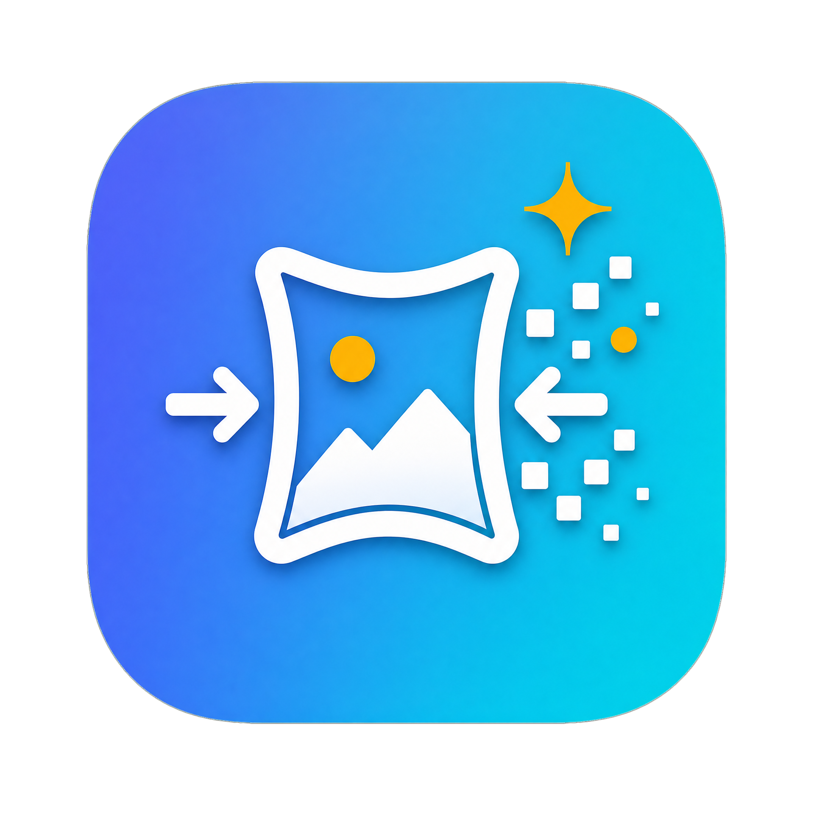

# Squeeze Pix — Premium Bulk Compressor & Studio

<p align="center">
  
</p>

<p align="center">
  <b>Shrink images fast ⚡ • Keep quality high 🎯 • Edit smarter 🧠 • Remove backgrounds instantly ✂</b>
  <br>
  A premium, high-fidelity image compression and AI suite built with Flutter.
</p>

---

## 🚀 Key Features

### 🗜️ 1. Premium Bulk & Single Compression
- **Zero Loss / Max Savings Modes**: Tweak compression ratios via a smooth, dynamic slider with live estimated size savings.
- **Target Size Limits**: Specify maximum size boundaries (e.g., limit output strictly under 200 KB) with smart preset chips.
- **Batch Processing**: Select and compress dozens of photos simultaneously. Includes a background isolate engine to keep the UI running at 120 FPS.
- **Smart ZIP Export & Extraction**: Package all compressed results into structured ZIP files automatically for fast sharing.

### ✂ 2. AI Tools Studio (Platinum Ultra)
- **1-Tap AI Background Remover**: Transparent cutouts processed instantly using deep learning with live token indicators.
- **AI Photo Enhancer**: Bakes facial upsampling, background reconstruction, and 2x resolution restoration onto old or blurry images.
- **Professional AI Headshots**: Generates professional portrait photography with high facial fidelity from normal uploads.
- **Dynamic Lock Banners**: Beautiful, unified locks that guide non-Ultra users directly to the **Platinum Ultra Upgrade Screen** before usage.

### 📐 3. Advanced Single Image Editor
- Crop, rotate, and aspect-ratio-lock resize tools.
- Output conversion: Convert formats on-the-fly to **JPG**, **PNG**, or **PDF**.
- Custom image filters: Sepia, Sketch, Grayscale, Vignette, Monochrome, Solarize, and smooth weighting adjustments.
- Premium glassmorphic editor bottom sheets with modern slide transitions and spring physics.

### 📜 4. Unified Creation History
- Organized tab panels tracking all creations: **Compressed**, **Edited**, **DP Maker**, **ID Photos**, and **Memes**.
- Automatically updates history upon completing single compressions, batch processing, or edits.
- Clear file size stats and instant tap-to-open viewer triggers.

### 💎 5. Premium Upgrade & Localization
- **Pro Upgrade Screen**: Interactive purchase paths containing Gold Pro and Platinum Ultra tiers.
- **Native Currency Pricing**: Dynamic locale detection to display store listings automatically in the user's local currency.
- **In-App Review System**: Prompt-less reviews triggered after active usage.

---

## 🛠️ Tech Stack & Architecture

- **Core Framework**: Flutter (Material 3)
- **State Management**: GetX
- **Database / Local Storage**: GetStorage (persists tokens, preferences, and unified history)
- **Heavy Computing**: Isolates (`compute`) for non-blocking multi-threaded batch operations.
- **API Services**: Replicate backend integration for AI models (InstantID & RemBG).
- **In-App Purchase / Review**: `in_app_purchase` & `in_app_review`.

---

## 📂 Project Structure

```text
lib/
 ├── controllers/
 │    ├── editor_controller.dart     # Handles resize, crop, filter transformations
 │    ├── history_controller.dart    # Manages unified tab histories
 │    ├── home_controller.dart       # Coordinates picker and batch isolate engines
 │    ├── iap_controller.dart        # Implements premium sub checks and tokens
 │    └── unity_ads_controller.dart  # Configures ad displays and rewards
 ├── pages/
 │    ├── pixel_lab/                 # AI Background remover, enhancer, headshots
 │    ├── editor_hub.dart            # Main single image editor screen
 │    ├── home_page.dart             # Responsive staggered grid view & batch action sheet
 │    ├── history_screen.dart        # Unified creations viewer tab
 │    └── pro_upgrade_screen.dart    # Premium packages and checkout page
 ├── theme/
 │    └── app_theme.dart             # Defines neon glassmorphism palettes
 ├── widgets/
 │    ├── glass_card.dart
 │    ├── glassmorphic_button.dart
 │    └── result_preview_dialog.dart # Premium before/after preview controller
 └── main.dart
```

---

## 🚀 How to Run

1. Clone the repository and fetch dependencies:
   ```bash
   flutter pub get
   ```
2. Build and run on your target emulator or device:
   ```bash
   flutter run
   ```
